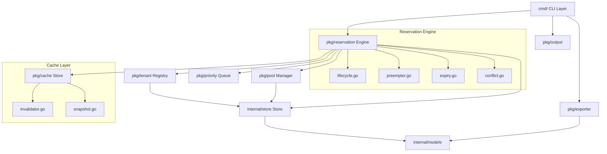

# ⚡ Resgate — Resource Reservation Engine

> Priority-aware, concurrent-safe resource reservation for multi-tenant environments.

[](https://golang.org)
[](LICENSE)
[](https://github.com/spf13/cobra)

---

<p align="center">
  
</p>

---

<table>
  <tr>
    <td></td>
    <td></td>
  </tr>
  <tr>
    <td></td>
    <td></td>
  </tr>
</table>

---

## Features

- 🏊 Shared resource pools with CPU, memory, and GPU tracking
- 👥 Multi-tenant registration with priority levels (1–10)
- ⚡ Priority-based preemption — high priority evicts low priority
- ⏱️ TTL-based reservation expiry with automatic sweep
- 🔒 Concurrent-safe access via `sync.RWMutex` throughout
- 🚨 Conflict detection — duplicate reservations rejected
- 📊 Live utilization bars in watch mode and status
- 📤 Export history as JSON or CSV
- 💾 Optional JSON file persistence across CLI invocations
- 🎨 Colorized output — green healthy, yellow warning, red exhausted

---

## CLI Commands

| Command | Description |
|---|---|
| `resgate pool create --name pool1 --cpu 32 --memory 65536 --gpu 8` | Create a resource pool |
| `resgate pool list` | List all pools with utilization |
| `resgate pool show --name pool1` | Show pool details |
| `resgate tenant add --name tenant1 --priority 5` | Register a tenant |
| `resgate tenant list` | List all tenants by priority |
| `resgate reserve --tenant t1 --pool pool1 --cpu 4 --memory 8192 --ttl 300` | Reserve resources |
| `resgate unreserve --id <id>` | Release a reservation |
| `resgate preempt --tenant t2 --target t1` | Preempt lower priority tenant |
| `resgate list` | List all active reservations |
| `resgate status` | System status and utilization |
| `resgate export --format json` | Export reservation history |
| `resgate watch` | Live watch mode (refreshes every 3s) |
| `resgate version` | Show version info |

---

## Core Concepts

**Resource Pool** — A named pool of CPU cores, memory (MB), and GPU units shared across tenants.

**Tenant** — A named consumer with a priority level (1 = lowest, 10 = highest). Priority determines preemption rights.

**Reservation** — A claim on specific resources in a pool. Has an optional TTL; expires automatically when the TTL elapses.

**Preemption** — A tenant with strictly higher priority can evict all active reservations belonging to a lower-priority tenant, freeing those resources immediately.

**TTL Expiry** — Reservations with a TTL are swept on every mutating operation. Resources are returned to the pool automatically.

**Conflict Detection** — A tenant cannot hold two active reservations in the same pool simultaneously.

---

## Tech Stack

| Component | Library |
|---|---|
| CLI framework | [cobra](https://github.com/spf13/cobra) |
| Configuration | [viper](https://github.com/spf13/viper) |
| Concurrency | `sync.RWMutex` (stdlib) |
| Persistence | `encoding/json` (stdlib) |
| Table output | [tablewriter](https://github.com/olekukonko/tablewriter) |
| Colors | [fatih/color](https://github.com/fatih/color) |

---

## Architecture



---

## Prerequisites

- Go 1.21 or higher
- Git
- make (optional)

---

## Install & Run Locally

```bash
git clone https://github.com/mdryaan/resgate.git
cd resgate
go mod tidy
go build -o resgate .
./resgate --help
```

Or install globally:

```bash
go install github.com/mdryaan/resgate@latest
```

---

## Example Usage

```bash
# Create a resource pool
./resgate pool create --name pool1 --cpu 32 --memory 65536 --gpu 8

# Register tenants
./resgate tenant add --name tenant1 --priority 5
./resgate tenant add --name tenant2 --priority 8

# Reserve resources
./resgate reserve --tenant tenant1 --pool pool1 --cpu 4 --memory 8192 --ttl 300
./resgate reserve --tenant tenant2 --pool pool1 --cpu 8 --memory 16384

# List active reservations
./resgate list

# System status with utilization bars
./resgate status

# Preempt lower priority tenant
./resgate preempt --tenant tenant2 --target tenant1

# Export history
./resgate export --format json
./resgate export --format csv --output history.csv

# Live watch mode
./resgate watch --interval 2
```

---

## Contributing

See [CONTRIBUTING.md](CONTRIBUTING.md) for dev setup, how to add commands, exporters, and extend the engine.

---

## License

MIT © 2026 [Md Raiyan](https://github.com/mdryaan)
